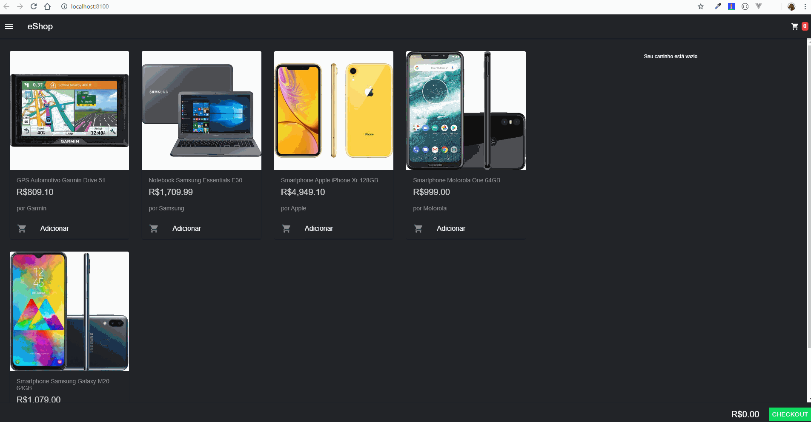

# Criando Apps Web com Angular e Redux

Projeto feito durante o curso **7189 - Criando Apps Web com Angular e Redux** que usa [NGRX](https://ngrx.io/) para gerenciamento de estado da aplicação.




## Iniciando

Foi usado durante o projeto o [Mockoon](https://mockoon.com/) para retornar uma lista mockada de produtos. Basta importador o aquivo **server.json** no Mockoon e API já estará funcionando.

### Pré-requisitos

Necessário ter [Node.js](https://nodejs.org/en/) e depois instalar [Angular](https://angular.io/) e [ionic](https://nodejs.org/en/):

```

npm install -g @angular/cli
npm install -g ionic

```


### Instalação


Na pasta do projeto, execute:


```

npm install

```

  

Depois inicie a aplicação:

  

```

ionic serve
```

## Feito com

  

* [Angular](https://angular.io/) - Framework Javascript

* [ionic](https://ionicframework.com/) - Cross-platform hybrid API

* [NGRX](https://rometools.github.io/rome/) - State Management 
  

## Agradecimentos


* [Balta.io](https://balta.io/) 
